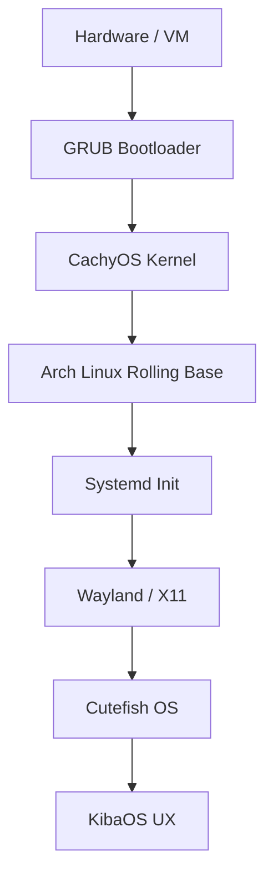

# KibaOS Wiki
Welcome to the unified KibaOS documentation.

## Table of Contents
- [Architecture](#architecture)
- [Build System](#build-system)
- [Contributing](#contributing)
- [Faq](#faq)
- [Manual Compilation](#manual-compilation)
- [Security Compliance](#security-compliance)
- [Software Management](#software-management)
- [Ux Design](#ux-design)

<a name="architecture"></a>
## Architecture

<p align="center">

</p>

<p align="center">


</p>

---

This document provides a technical overview of the KibaOS architectural stack, from the base system to the final user-facing components.

---

## Table of Contents

- [System Stack](#system-stack)
- [Core Foundation](#core-foundation)
- [Arch Linux base (Rolling)](#debian-13-trixie)
- [CachyOS Kernel](#cachyos-kernel)
- [Init & Display](#init--display)
- [Extreme Minimization](#extreme-minimization)
- [Documentation & Help](#documentation--help)
- [Locale Pruning](#locale-pruning)
- [Dependency Pruning](#dependency-pruning)
- [Filesystem & Boot Performance](#filesystem--boot-performance)
- [SquashFS Optimization](#squashfs-optimization)
- [Initramfs](#initramfs)
- [Binary Compression](#binary-compression)
- [Bootloader](#bootloader)
- [Related Reading](#related-reading)

---

## System Stack



---

## Core Foundation

### Arch Linux base (Rolling)

KibaOS is built upon the **Arch Linux base (Rolling)** testing branch. This allows us to offer cutting-edge software packages (like Cutefish OS) while inheriting the robust package management and security infrastructure of Arch Linux.

### CachyOS Kernel

We replace the stock Arch Linux kernel with the **CachyOS Kernel** (integrated via `linux-cachyos-deb`).

- **BORE Scheduler:** Optimized for desktop responsiveness.
- **Improved Performance:** Built with modern compiler optimizations.
- **Gaming Ready:** Includes patches for improved wine/proton performance.

> [!IMPORTANT]
> To maintain a clean system, we explicitly purge the stock `linux-image-amd64` and `linux-headers-amd64` meta-packages during the build process to ensure only the optimized CachyOS kernel remains.

### Init & Display

- **Init System:** **Systemd** provides reliable service orchestration.
- **Display Server:** **Wayland** is the default for its security and modern features, with **X11** (via XWayland) ensuring compatibility with legacy applications.

---

## Extreme Minimization

KibaOS follows a strict "No Bloat" policy. We use aggressive strategies to keep the ISO size small and the runtime environment lean.

### Documentation & Help

During the build process, a custom hook removes all non-essential documentation to save hundreds of megabytes:

- **Paths:** `/usr/share/doc`, `/usr/share/man`, `/usr/share/info`, `/usr/share/help`.
- **Exception:** Shell integration scripts (e.g., **`fzf`** examples) are moved to `/usr/share/fzf` before the purge.

### Locale Pruning

We only keep **`en`** and **`en_US`** locales. All other translations are removed from `/usr/share/locale`, significantly reducing the package footprint.

### Dependency Pruning

We avoid meta-packages like `kde-plasma-desktop`. Instead, we install `plasma-bigscreen` and `plasma-workspace` and manually add only the essential KDE components required for a functional desktop.

---

## Filesystem & Boot Performance

### SquashFS Optimization

The live root filesystem is compressed using **Zstd** at level 19 with a 1MB block size.

- **Benefit:** High compression ratio (smaller ISO) with extremely fast decompression (faster app launches).

### Initramfs

### Documentation Stripping

During the build process, a custom hook removes all non-essential documentation files:

- `/usr/share/doc/*`
- `/usr/share/man/*`
- `/usr/share/info/*`
- `/usr/share/help/*`

_Note: Critical shell integration scripts (like those for `fzf`) are preserved before stripping._

### Locale Optimization

To save space, KibaOS limits system locales to only `en` and `en_US`. All other locale data is purged from `/usr/share/locale`.

### Dependency Pruning (Optimized)

We avoid heavy meta-packages. For example, instead of `kde-plasma-desktop`, we install a hand-picked minimal set including `plasma-bigscreen` and `plasma-workspace`, adding only the necessary components for a functional and beautiful desktop.

### Binary Compression

ELF binaries in `/usr/bin` and `/usr/sbin` (larger than 64KB) are compressed using **UPX** (Ultimate Packer for eXecutables) with the `--best` setting. Critical system components (like systemd, sddm, and the kernel) are excluded from compression to ensure system stability.
Configured for maximum compression using **`zstd -19`** in **`/etc/initramfs-tools/initramfs.conf`**. This reduces the size of the initial RAM disk, leading to faster boot times.

### Bootloader

KibaOS uses **GRUB** (`grub-pc` and `grub-efi`) as the primary bootloader.

- **Hybrid Support:** Works on both BIOS (Legacy) and UEFI systems.
- **Branded Menu:** A custom binary hook patches `grub.cfg` to provide user-friendly, branded menu entries like _"Start KibaOS"_ and _"Install KibaOS"_.

---

## Related Reading

- [**Build System**](./build-system.md)
- [**UX & Design**](./ux-design.md)
- [**WIKI**](../WIKI.md)

---

<a name="build-system"></a>
## Build System

<p align="center">

</p>

<p align="center">


</p>

---

KibaOS utilizes a highly automated CI/CD pipeline to generate reproducible ISO images. This document details the infrastructure, build stages, and customization hooks used in the process.

---

## Build Pipeline

````mermaid
graph LR
A[Push to Main] --> B[GitHub Action]
B --> C[Setup Docker]
C --> D[lb config]
D --> E[Custom Hooks]
E --> F[lb build]
F --> G[ISO Generation]
G --> H[Verification]
H --> I[Upload to SourceForge]
```bash

---

## Infrastructure

- **Orchestration:** **GitHub Actions** (`.github/workflows/kiba.yml`) manages the build lifecycle.
- **Environment:** Builds run inside a **Arch Linux Rolling** Docker container to ensure environment consistency.
- **Backend:** **live-build (lb)** is used to assemble the Arch Linux-based live system.

---

## Customization Hooks

KibaOS relies on a series of chroot and binary hooks to apply its unique features. These hooks are dynamically created by the GitHub Action workflow before the build starts.

### Chroot Hooks

_Executed inside the temporary system environment._

| Hook                                        | Purpose                                                                            |
| :------------------------------------------ | :--------------------------------------------------------------------------------- |
| **`0030-starship.hook.chroot`**             | Installs the Starship cross-shell prompt.                                          |
| **`0045-cachyos-kernel.hook.chroot`**       | Replaces the stock kernel with CachyOS and purges stock meta-packages.             |
| **`0050-upx-compress.hook.chroot`**         | Aggressively compresses ELF binaries using UPX.                                    |
| **`0055-bazaar-native.hook.chroot`**        | Builds **KibaStore** (Bazaar) from source and configures the desktop entry.        |
| **`0056-ungoogled-chromium.hook.chroot`**   | Integrates Ungoogled Chromium via an OBS repository.                               |
| **`0090-extreme-minimization.hook.chroot`** | Purges documentation, help files, and non-English locales.                         |
| **`0100-customize.hook.chroot`**            | Applies Dracula theme, Plasma settings, shell aliases, and system identity.        |
| **`0110-calamares-branding.hook.chroot`**   | Configures the Calamares installer with KibaOS branding and the age-verify module. |

### Binary Hooks

_Executed on the final ISO filesystem._

| Hook                                        | Purpose                                                                        |
| :------------------------------------------ | :----------------------------------------------------------------------------- |
| **`0010-squashfs-compression.hook.binary`** | Repacks the SquashFS with maximum Zstd level 19 compression.                   |
| **`0020-bootloader-branding.hook.binary`**  | Patches `grub.cfg` to provide branded and beginner-friendly boot menu options. |

---

## Local Development

You can reproduce the KibaOS build environment locally on any Linux machine with Docker.

### Requirements

- **Docker** installed and running.
- At least **15 GB** of free disk space.
- An active internet connection.

### Build Steps

```bash
git clone [https://github.com/WolfTech-Innovations/Kiba](https://github.com/WolfTech-Innovations/Kiba)
cd Kiba
docker run --rm --privileged \
-v "$PWD:/w" \
-e RUN_NUM=local \
archlinux:latest \
/w/build.sh
```bash

_Note: The `build.sh` script is generated by the GitHub Actions workflow. Ensure you have at least 15GB of free space._

> [!NOTE]
> The `build.sh` script is the entry point that orchestrates `lb config` and `lb build`. It is generated by the CI workflow, but you can find its logic in `.github/workflows/kiba.yml`.

---

## Verification & Delivery

After the build completes, the pipeline performs several verification steps:

1. **Grep Logs:** Ensures `cachyos`, `starship`, and other critical components were successfully processed.
2. **Checksum:** Generates a SHA256 hash of the final ISO.
3. **Upload:** Automatically pushes the ISO to **SourceForge** if the build was triggered from the `main` branch.

---

## Related Reading

- [**Architecture**](./architecture.md)
- [**Software Management**](./software-management.md)
- [**Contributing**](./contributing.md)
````

---

<a name="contributing"></a>
## Contributing

<p align="center">

</p>

<p align="center">


</p>

---

First of all, thank you for your interest in contributing to KibaOS! We welcome contributions from developers, designers, and documentation enthusiasts.

---

## Developer Quick Start

To begin contributing to the KibaOS build system or customization hooks, follow these steps:

1. **Fork the Repo:** Create your own fork of [WolfTech-Innovations/Kiba](https://github.com/WolfTech-Innovations/Kiba).
2. **Setup Environment:** Ensure you have **Docker** installed on a Linux host.
3. **Local Build:** Run a local build to ensure your environment is working:

```bash
git clone https://github.com/YOUR_USERNAME/Kiba
cd Kiba
docker run --rm --privileged -v "$PWD:/w" -e RUN_NUM=local archlinux:latest /w/build.sh
```

---

## How to Contribute

### Reporting Bugs

If you find a bug, please open an issue on our [GitHub repository](https://github.com/WolfTech-Innovations/Kiba/issues). Provide as much detail as possible, including:

- A clear and descriptive title.
- Steps to reproduce the bug.
- Expected and actual behavior.
- Screenshots or logs if applicable.

### Suggesting Features

We are always looking for ways to improve KibaOS. If you have an idea for a new feature, please open an issue and describe:

- The problem your feature would solve.
- How the feature would work.
- Any alternative solutions you've considered.

### Submitting Pull Requests

If you're ready to contribute code or documentation:

1. **Fork the repository** and create your branch from `main`.
2. **Follow the coding style** used in the project.
3. **Verify your changes** by running relevant build scripts or tests.
4. **Submit a pull request** with a clear description of your changes and reference any related issues.
If you find a bug, please open an issue. Provide:

- Steps to reproduce.
- Expected vs. Actual behavior.
- System logs or screenshots.

### Suggesting Features (Community)

We love new ideas! Please open an issue to discuss significant features before implementation. This ensures they align with the KibaOS philosophy of "modern simplicity."

### Submitting Pull Requests (Process)

- **Branching:** Work on a descriptive branch name (e.g., `feature/custom-icons`).
- **Commits:** Follow conventional commit messages.
- **Testing:** Always run a local build (see above) to verify your changes don't break the ISO generation.

---

## Project Structure

| Directory               | Purpose                                         |
| :---------------------- | :---------------------------------------------- |
| **`.github/workflows`** | GitHub Actions build and release orchestration. |
| **`branding/`**         | Visual assets (banners, logos).                 |
| **`docs/`**             | Technical documentation.                        |
| **`README.md`**         | Main project entry point.                       |
| **`WIKI.md`**           | Detailed technical manual.                      |

> [!TIP]
> Most of the system customization logic resides in the **`build.sh`** generation block within **`.github/workflows/kiba.yml`**. Look for the `cat > config/hooks/live/...` sections.

---

## Automated Triage

We use automated workflows to help manage the project:

- **Labeler:** Automatically labels PRs based on changed files.
- **Issue Triage:** Auto-labels new issues based on keywords (`bug`, `feature`, etc.).
- **Stale:** Automatically closes inactive issues after a period of time.

---

## License

By contributing to KibaOS, you agree that your contributions will be licensed under the **MIT License**.

---

## Related Reading

- [**Build System**](./build-system.md)
- [**Architecture**](./architecture.md)
- [**FAQ**](./faq.md)

---

<a name="faq"></a>
## Faq

<p align="center">

</p>

<p align="center">

</p>

---

## General Questions

### What is KibaOS

KibaOS is a modern, lightweight Linux distribution built on **Arch Linux base (Rolling)** with **Cutefish OS** and the **CachyOS kernel**. It is designed to be simple, beautiful, and ready to use out-of-the-box.

### Why "Kiba"

Kiba (牙) means "Fang" in Japanese. The name reflects our goal of creating a sharp, lean, and powerful system that cuts through the bloat of modern computing.

### Who is KibaOS for

KibaOS is designed for beginners who want a beautiful and fast system, as well as power users who appreciate a pre-configured, modern terminal experience and a performance-optimized kernel.

---

## Technical Questions

### Why Arch Linux Rolling (Testing)

We use **Arch Linux Rolling** to provide users with modern software like Cutefish OS and the latest toolchains, while still benefiting from Arch Linux's legendary stability and massive package repository.

### What is the CachyOS Kernel

It is a performance-optimized Linux kernel that uses the **BORE scheduler**. It is specifically tuned for desktop responsiveness, making the system feel much snappier under load compared to the stock Arch Linux kernel.

### How do I update KibaOS

You can update through **KibaStore** (graphical) or simply by typing **`update`** in the terminal. This is a pre-configured alias that runs `sudo pacman -Syu`.

### Can I change the theme

Absolutely! While KibaOS comes pre-configured with the **Dracula** theme, it is a standard Cutefish OS system. You can change the global theme, icons, and colors in **System Settings**.

---

## Software Questions

### What is KibaStore

**KibaStore** is our native build of **Bazaar**. It is a lightweight graphical store designed specifically for discovering and managing **Flatpaks**.

### Why Ungoogled Chromium

We chose **Ungoogled Chromium** as the default browser because it provides a familiar Chrome-like experience but with all Google tracking and background services removed for better privacy.

### Can I install standard `.deb` packages

Yes! Since KibaOS is based on Arch Linux, you can install any compatible `.deb` file using **Nala** (`sudo pacman -S ./file.deb`) or standard `dpkg`.

---

## Troubleshooting

### The installer didn't start automatically

In the live session, the installer is pinned to the desktop and the taskbar. If it fails to launch, open a terminal and type `sudo calamares`.

### My Wi-Fi isn't working

KibaOS includes the `non-free-firmware` repository by default to support most modern wireless cards. If your card isn't detected, you may need to install a specific driver via `pacman`.

---

## Related Reading

- [**Architecture**](./architecture.md)
- [**UX & Design**](./ux-design.md)
- [**WIKI**](../WIKI.md)

---

<a name="manual-compilation"></a>
## Manual Compilation

This guide provides step-by-step instructions for manually compiling the Cutefish OS Desktop Environment on KibaOS (Arch Linux base).

## Prerequisites

Install the necessary build tools and base dependencies:

```bash
sudo pacman -S --needed base-devel cmake extra-cmake-modules ninja git
sudo pacman -S --needed qt5-base qt5-quickcontrols2 qt5-x11extras qt5-tools qt5-svg \
kwindowsystem polkit-qt5 xorg-server-devel xf86-input-libinput \
xf86-input-synaptics libxcb libxcursor libxtst libpulse libkscreen libstatgrab
```

## Build Order

To ensure all dependencies are met, follow this specific build order:

1.  **fishui** (GUI Library)
2.  **libcutefish** (Common Library)
3.  **core** (System Backend)
4.  **Desktop Components** (Dock, Launcher, Statusbar, Settings, Wallpapers)
5.  **Applications** (Terminal, FileManager, Calculator, etc.)

---

## Step 1: fishui

```bash
git clone https://github.com/cutefishos/fishui.git
cd fishui
mkdir build && cd build
cmake -DCMAKE_INSTALL_PREFIX=/usr -GNinja ..
ninja
sudo ninja install
cd ../..
```

## Step 2: libcutefish

```bash
git clone https://github.com/cutefishos/libcutefish.git
cd libcutefish
mkdir build && cd build
cmake -DCMAKE_INSTALL_PREFIX=/usr -GNinja ..
ninja
sudo ninja install
cd ../..
```

## Step 3: core

```bash
git clone https://github.com/cutefishos/core.git
cd core
mkdir build && cd build
cmake -DCMAKE_INSTALL_PREFIX=/usr -GNinja ..
ninja
sudo ninja install
cd ../..
```

## Step 4: Desktop Components

Repeat the following process for each repository: `dock`, `launcher`, `statusbar`, `settings`, `wallpapers`, `icons`.

```bash
REPO="dock" # Change to launcher, statusbar, etc.
git clone https://github.com/cutefishos/$REPO.git
cd $REPO
mkdir build && cd build
cmake -DCMAKE_INSTALL_PREFIX=/usr -GNinja ..
ninja
sudo ninja install
cd ../..
```

## Step 5: Applications

Repeat for: `terminal`, `filemanager`, `calculator`, `screenshot`.

```bash
REPO="terminal"
git clone https://github.com/cutefishos/$REPO.git
cd $REPO
mkdir build && cd build
cmake -DCMAKE_INSTALL_PREFIX=/usr -GNinja ..
ninja
sudo ninja install
cd ../..
```

## Starting the Session

After installing all components, you can start Cutefish OS using SDDM or by adding the following to your `.xinitrc`:

```bash
exec cutefish-session
```

---

<a name="security-compliance"></a>
## Security Compliance

<p align="center">

</p>

<p align="center">


</p>

---

KibaOS is built with a "Privacy by Design" philosophy. We go beyond standard security practices to ensure compliance with modern digital safety laws and to minimize the system's attack surface.

---

## California Age-Appropriate Design Code (AB 2273)

To comply with the California Age-Appropriate Design Code Act, KibaOS features a custom **Age Verification** module within the **Calamares** installer.

### Implementation

- **Module:** A custom Python-based view module located at `/usr/lib/calamares/modules/ageverify/`.
- **User Interface:** During installation, users are presented with a screen to select their age group (e.g., Under 13, 13-15, 16-17, 18+, or "Prefer not to say").
- **Transparency:** The screen clearly explains why this information is being collected and how it is stored.

### Privacy and Data Storage

In accordance with KibaOS's privacy-first philosophy:

- **Local Storage Only:** The selected age group is stored exclusively on the user's local machine at `/etc/kibatv/age-verify`.
- **No Transmission:** This data is **never** transmitted to WolfTech Innovations or any other external servers.
- **Purpose:** This local record ensures the system can provide an age-appropriate experience as mandated by law without compromising user anonymity.

- **Technical Stack:** A custom Python view module using the `pythonqt` interface.
- **User Choice:** During installation, users are prompted to select their age group (Under 13, 13-15, 16-17, 18+, or Decline to state).
- **Purpose:** This allows the system to potentially apply age-appropriate safety defaults without requiring a central account or online tracking.

### Privacy Policy: Local Storage Only

In strict adherence to our privacy goals:

- **No Transmission:** Your age selection is **never** sent to WolfTech Innovations or any third party.
- **Local Record:** Data is stored exclusively at **`/etc/kibatv/age-verify`**.
- **User Control:** You can delete or modify this file at any time after installation.

---

## System Hardening

KibaOS implements several strategies to keep your data safe and your system resilient.

### Minimal Attack Surface

By following our **Extreme Minimization** strategy, we remove hundreds of non-essential packages, documentation, and services.

- **Result:** Fewer installed binaries means fewer potential vulnerabilities (CVEs) on your system.

### Kernel Security

The **CachyOS Kernel** isn't just for performance; it includes modern security patches and is regularly updated to mitigate emerging hardware and software threats.

### Account Security

- **Live Session:** The `user` account has passwordless sudo for ease of testing.
- **Installed System:** The installer forces the creation of a secure root and user password, and the passwordless sudo privilege is automatically revoked.

---

## Privacy by Design

We believe your operating system should be a tool, not a tracker.

- **No Telemetry:** KibaOS does not include any built-in telemetry or data collection services.
- **Ungoogled Chromium:** Our default browser is stripped of Google-specific tracking and background services.
- **Flatpak Sandboxing:** We encourage the use of Flatpaks via **KibaStore**, which provides an additional layer of isolation between your applications and your private data.

---

## Related Reading

- [**Architecture**](./architecture.md)
- [**Software Management**](./software-management.md)
- [**WIKI**](../WIKI.md)

---

<a name="software-management"></a>
## Software Management

<p align="center">

</p>

<p align="center">


</p>

---

KibaOS provides a dual-layered approach to software management: a beginner-friendly graphical store and a powerful, modern command-line interface.

---

## KibaStore (Bazaar)

The primary graphical interface for managing software in KibaOS is **KibaStore**, which is a native implementation of **Bazaar**.

### Native Build Philosophy

Unlike other distributions that ship heavy, generic software centers, KibaStore is:

- **Built from Source:** Compiled during the ISO build process using `meson` and `ninja`.
- **Lightweight:** Designed specifically to manage **Flatpaks** without the overhead of the full GNOME or KDE software suites.
- **Modern UI:** Built with **GTK4** and **Libadwaita**, providing a sleek and responsive user interface.

### Flatpak Integration

KibaStore comes pre-configured with the **Flathub** remote. This gives you instant access to thousands of sandboxed applications like:

- **Productivity:** LibreOffice, Obsidian, Slack.
- **Creative:** GIMP, Inkscape, OBS Studio.
- **Gaming:** Steam, Heroic Games Launcher, Discord.

---

## Terminal Package Management (Pacman)

For those who prefer the command line, KibaOS defaults to **Pacman** — a modern frontend for `pacman` that makes package management beautiful and safer.

### Why Pacman

- **Parallel Downloads:** Downloads multiple packages simultaneously to save time.
- **Transaction History:** View every install/remove operation and easily **undo** changes.
- **Beautiful Output:** Clearer, color-coded summaries of what will be installed or removed.

### Common Commands

| Task                     | Command                                                        |
| :----------------------- | :------------------------------------------------------------- |
| **Update system**        | `update` _(Alias for `sudo pacman -Syu`)_ |
| **Search for a package** | `search <name>`                                                |
| **Install a package**    | `install <name>`                                               |
| **Remove a package**     | `remove <name>`                                                |
| **View history**         | `pacman -Qi`                                                 |
| **Undo an operation**    | `sudo pacman -Qi undo <ID>`                                  |

> [!NOTE]

---

## Specialized Repositories

### Ungoogled Chromium

KibaOS includes **Ungoogled Chromium** as a privacy-focused browser alternative. It is integrated into the system via a dedicated Open Build Service (OBS) repository to ensure regular updates directly from the source.

### Modern CLI Suite

As detailed in the [UX Design](./ux-design.md) document, KibaOS ships with a suite of modern CLI tools like `eza`, `bat`, `btop`, and `yt-dlp` to provide a superior terminal experience.

KibaOS includes **Ungoogled Chromium** as the default browser for users who prioritize privacy. It is integrated via a dedicated **OBS (Open Build Service)** repository, ensuring you receive timely security updates directly from the source.

### Flatpak (CLI)

While KibaStore is the preferred way to browse, you can manage Flatpaks directly from the terminal:

````bash

## Search for an app

flatpak search <name>

## Install an app

flatpak install flathub <app-id>
```bash

---

## Related Reading

- [**Architecture**](./architecture.md)
- [**UX & Design**](./ux-design.md)
- [**WIKI**](../WIKI.md)
````

---

<a name="ux-design"></a>
## Ux Design

<p align="center">

</p>

<p align="center">


</p>

---

KibaOS is built with a focus on "modern simplicity." This document details the visual identity, the Dracula-inspired aesthetic, and the highly optimized terminal experience.

---

## Table of Contents

- [Visual Identity](#visual-identity)
- [Color Palette](#color-palette)
- [Look and Feel](#look-and-feel)
- [Window Management](#window-management)
- [Shell Experience](#shell-experience)
- [Starship Prompt](#starship-prompt)
- [Modern CLI Tools](#modern-cli-tools)
- [System-wide Aliases](#system-wide-aliases)
- [Boot Branding](#boot-branding)
- [Interface Components](#interface-components)
- [Typography](#typography)
- [Desktop Experience (Cutefish OS)](#desktop-experience-plasma-bigscreen)
- [Window Management Polish](#window-management-polish)
- [Desktop Layout](#desktop-layout)
- [The Modern Terminal](#the-modern-terminal)
- [Modern Alternative Comparison](#modern-alternative-comparison)
- [Shell Configuration (Zsh)](#shell-configuration-zsh)
- [Related Reading](#related-reading)

---

## Visual Identity

The KibaOS aesthetic is built around the official **Dracula** color palette, providing a high-contrast, dark interface that reduces eye strain and looks modern.

### Color Palette

| Color            | Hex         | Role                                                     |
| :--------------- | :---------- | :------------------------------------------------------- |
| **Background**   | `#282a36` | Primary window and desktop background                    |
| **Current Line** | `#44475a` | Highlight and secondary background                       |
| **Foreground**   | `#f8f8f2` | Primary text color                                       |
| **Comment**      | `#6272a4` | Secondary text and disabled elements                     |
| **Purple**       | `#bd93f9` | Accent color, selection background, and primary branding |
| **Pink**         | `#ff79c6` | Selection foreground and highlights                      |
| **Green**        | `#50fa7b` | Success states and active terminal elements              |

### Look and Feel

- **Desktop Environment:** Cutefish OS.
- **Global Theme:** A customized version of **Ant-Dark**.
- **Color Scheme:** **Dracula**, applied system-wide to Plasma widgets, window decorations, and applications.
- **Icons:** **Kora** icon theme for a colorful and modern look.
- **Cursors:** **Vimix** cursor theme.
- **Fonts:** **Inter** for the system UI and **JetBrains Mono** for monospace/terminal text.

### Window Management

- **Rounded Corners:** KWin is configured to provide 16px rounded corners for all windows.
- **Glass Effects:** Blur and contrast effects are enabled for an elegant, translucent look.
- **Floating Panel:** The Plasma panel is configured to be floating and rounded by default.

## Shell Experience

KibaOS provides a highly optimized terminal experience using **Zsh** as the default shell for all users.

### Starship Prompt

The **Starship** cross-shell prompt is pre-installed and configured with a minimalist Dracula-themed layout.

### Modern CLI Tools

We prefer modern, faster alternatives to classic Unix commands:

- **`pacman`**: A beautiful and feature-rich frontend for `pacman`.
- **`eza`**: A modern replacement for `ls` with icons and color-coding.
- **`bat`**: A `cat` clone with syntax highlighting and Git integration.
- **`fastfetch`**: A fast and highly customizable system information tool.
- **`btop`**: An interactive resource monitor.
- **`ripgrep` (`rg`)**: An extremely fast alternative to `grep`.
- **`fd-find` (`fd`)**: A simple, fast, and user-friendly alternative to `find`.
- **`tealdeer` (`tldr`)**: A fast implementation of `tldr` for simplified man pages.

### System-wide Aliases

Common aliases are configured in `/etc/zsh/zshrc` to improve workflow:

- `pacman` -> `pacman`
- `ls` -> `eza`
- `cat` -> `bat`
- `grep` -> `ripgrep`
- `update` -> `sudo pacman -Syu -y`
- `edit` -> `micro` (System default editor)
- `please` -> `sudo`
- `cls` -> `clear`
- `path` -> Multi-line `$PATH` overview

## Boot Branding

The branding experience starts from the moment the system boots:

- **Plymouth:** A custom "kibaos-spinner" theme with a Dracula-themed progress bar.
- **Grub**

### Interface Components

- **Global Theme:** A customized **Ant-Dark** theme, providing a consistent base for all applications.
- **Icons:** The **Kora** icon theme offers a colorful, modern, and high-resolution set of assets.
- **Cursors:** **Vimix-cursors** are used for a sleek, high-visibility pointer experience.
- **Typography:**
- **System UI:** **Inter** (11pt) — A modern sans-serif designed for screens.
- **Monospace:** **JetBrains Mono** (11pt) — Optimized for code and terminal legibility.

---

## Desktop Experience (Cutefish OS)

KibaOS leverages the power of **Cutefish OS** but configures it for a streamlined "out-of-the-box" experience.

### Window Management Polish

- **Rounded Corners:** Custom **KWin** rules apply 16px rounded corners to all windows.
- **Glass Effects:** Background blur and translucency are enabled for an elegant, layered look.
- **Floating Panel:** The system panel is configured to be floating and rounded by default, located at the bottom of the screen.

### Desktop Layout

- **Minimalist Panel:** Contains the application launcher, task manager, system tray, and clock.
- **Clean Desktop:** No icons by default, keeping the workspace clutter-free.

---

## The Modern Terminal

KibaOS provides one of the most powerful terminal experiences of any distribution, replacing aging Unix utilities with modern, faster, and more feature-rich alternatives.

### Modern Alternative Comparison

| Classic Command | Modern Alternative   | Key Feature                                       |
| :-------------- | :------------------- | :------------------------------------------------ |
| `ls`            | **`eza`**            | Icons, Git status integration, and better colors. |
| `cat`           | **`bat`**            | Syntax highlighting and Git integration.          |
| `grep`          | **`ripgrep`** (`rg`) | Extremely fast recursive search.                  |
| `find`          | **`fd`**             | Simple, fast, and user-friendly syntax.           |
| `top`           | **`btop`**           | Beautiful interactive resource monitoring.        |
| `df`            | **`duf`**            | Clear, color-coded disk usage overview.           |
| `du`            | **`ncdu`**           | Interactive disk usage analyzer.                  |
| `pacman`           | **`pacman`**           | Parallel downloads and clear transaction history. |

### Shell Configuration (Zsh)

**Zsh** is the default shell for all users, pre-configured with:

- **Starship Prompt:** A minimalist, fast, and informative cross-shell prompt.
- **Autosuggestions:** Fish-like autosuggestions as you type.
- **Syntax Highlighting:** Real-time highlighting of commands and arguments.
- **FZF Integration:** Fuzzy finding for command history and file navigation.

---

## Related Reading

- [**Architecture**](./architecture.md)
- [**Software Management**](./software-management.md)
- [**WIKI**](../WIKI.md)

---
