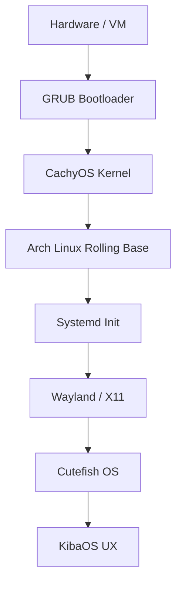

# Architecture Deep-Dive

  

  
  
  

---

This document provides a technical overview of the KibaOS architectural stack, from the base system to the final user-facing components.

---

## Table of Contents

- [System Stack](#system-stack)
- [Core Foundation](#core-foundation)
  - [Arch Linux base (Rolling)](#arch-linux-base-rolling)
  - [CachyOS Kernel](#cachyos-kernel)
  - [Init & Display](#init--display)
- [Extreme Minimization](#extreme-minimization)
  - [Documentation & Help](#documentation--help)
  - [Locale Pruning](#locale-pruning)
  - [Dependency Pruning](#dependency-pruning)
  - [Binary Compression](#binary-compression)
- [Filesystem & Boot Performance](#filesystem--boot-performance)
  - [SquashFS Optimization](#squashfs-optimization)
  - [Initramfs](#initramfs)
  - [Bootloader](#bootloader)
- [Related Reading](#related-reading)

---

## System Stack

---

## Core Foundation

### Arch Linux base (Rolling)

KibaOS is built upon the **Arch Linux base (Rolling)** testing branch. This allows us to offer cutting-edge software packages (like Cutefish OS) while inheriting the robust package management and security infrastructure of Arch Linux.

### CachyOS Kernel

We replace the stock Arch Linux kernel with the **CachyOS Kernel** (integrated via `linux-cachyos`).

- **BORE Scheduler:** Optimized for desktop responsiveness
- **Improved Performance:** Built with modern compiler optimizations
- **Gaming Ready:** Includes patches for improved wine/proton performance

> [!IMPORTANT]
> To maintain a clean system, we explicitly purge the stock `linux` and `linux-headers` packages during the build process to ensure only the optimized CachyOS kernel remains.

### Init & Display

- **Init System:** **Systemd** provides reliable service orchestration
- **Display Server:** **Wayland** is the default for its security and modern features, with **X11** (via XWayland) ensuring compatibility with legacy applications

---

## Extreme Minimization

KibaOS follows a strict "No Bloat" policy. We use aggressive strategies to keep the ISO size small and the runtime environment lean.

### Documentation & Help

During the build process, a custom hook removes all non-essential documentation to save hundreds of megabytes:

- **Paths Removed:** `/usr/share/doc`, `/usr/share/man`, `/usr/share/info`, `/usr/share/help`
- **Exception:** Shell integration scripts (e.g., **`fzf`** examples) are moved to `/usr/share/fzf` before the purge

### Locale Pruning

We only keep **`en`** and **`en_US`** locales. All other translations are removed from `/usr/share/locale`, significantly reducing the package footprint.

### Dependency Pruning

We avoid meta-packages like `kde-plasma-desktop`. Instead, we install a hand-picked minimal set including `plasma-workspace` and only the essential components for a functional desktop.

### Binary Compression

ELF binaries in `/usr/bin` and `/usr/sbin` (larger than 64KB) are compressed using **UPX** (Ultimate Packer for eXecutables) with the `--best` setting. Critical system components (like systemd, sddm, and the kernel) are excluded from compression to ensure system stability.

---

## Filesystem & Boot Performance

### SquashFS Optimization

The live root filesystem is compressed using **Zstd** at level 19 with a 1MB block size.

- **Benefit:** High compression ratio (smaller ISO) with extremely fast decompression (faster app launches)

### Initramfs

Configured with `zstd -19` for maximum compression, reducing the size of the initial RAM disk and leading to faster boot times.

### Bootloader

KibaOS uses **GRUB** (`grub-pc` and `grub-efi`) as the primary bootloader.

- **Hybrid Support:** Works on both BIOS (Legacy) and UEFI systems
- **Branded Menu:** A custom hook patches `grub.cfg` to provide user-friendly, branded menu entries like _"Start KibaOS"_ and _"Install KibaOS"_

---

## Related Reading

- [**Build System**](./build-system.md)
- [**UX & Design**](./ux-design.md)
- [**WIKI**](../WIKI.md)
