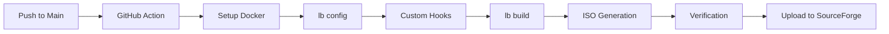

# Build System & Automation

<p align="center">
  
</p>

<p align="center">
  
  
  
</p>

---

KibaOS utilizes a highly automated CI/CD pipeline to generate reproducible ISO images. This document details the infrastructure, build stages, and customization hooks used in the process.

---

## Build Pipeline



---

## Infrastructure

- **Orchestration:** **GitHub Actions** (`.github/workflows/kiba.yml`) manages the build lifecycle.
- **Environment:** Builds run inside a **Debian Trixie** Docker container to ensure environment consistency.
- **Backend:** **live-build (lb)** is used to assemble the Debian-based live system.

---

## Customization Hooks

KibaOS relies on a series of chroot and binary hooks to apply its unique features. These hooks are dynamically created by the GitHub Action workflow before the build starts.

### Chroot Hooks

_Executed inside the temporary system environment._

| Hook                                        | Purpose                                                                            |
| :------------------------------------------ | :--------------------------------------------------------------------------------- |
| **`0030-starship.hook.chroot`**             | Installs the Starship cross-shell prompt.                                          |
| **`0045-cachyos-kernel.hook.chroot`**       | Replaces the stock kernel with CachyOS and purges stock meta-packages.             |
| **`0050-upx-compress.hook.chroot`**         | Aggressively compresses ELF binaries using UPX.                                    |
| **`0055-bazaar-native.hook.chroot`**        | Builds **KibaStore** (Bazaar) from source and configures the desktop entry.        |
| **`0056-ungoogled-chromium.hook.chroot`**   | Integrates Ungoogled Chromium via an OBS repository.                               |
| **`0090-extreme-minimization.hook.chroot`** | Purges documentation, help files, and non-English locales.                         |
| **`0100-customize.hook.chroot`**            | Applies Dracula theme, Plasma settings, shell aliases, and system identity.        |
| **`0110-calamares-branding.hook.chroot`**   | Configures the Calamares installer with KibaOS branding and the age-verify module. |

### Binary Hooks

_Executed on the final ISO filesystem._

| Hook                                        | Purpose                                                                        |
| :------------------------------------------ | :----------------------------------------------------------------------------- |
| **`0010-squashfs-compression.hook.binary`** | Repacks the SquashFS with maximum Zstd level 19 compression.                   |
| **`0020-bootloader-branding.hook.binary`**  | Patches `grub.cfg` to provide branded and beginner-friendly boot menu options. |

---

## Local Development

You can reproduce the KibaOS build environment locally on any Linux machine with Docker.

### Requirements

- **Docker** installed and running.
- At least **15 GB** of free disk space.
- An active internet connection.

### Build Steps

```bash
git clone https://github.com/WolfTech-Innovations/Kiba
cd Kiba
docker run --rm --privileged \
  -v "$PWD:/w" \
  -e RUN_NUM=local \
  debian:trixie \
  /w/build.sh
```

_Note: The `build.sh` script is generated by the GitHub Actions workflow. Ensure you have at least 15GB of free space._
> [!NOTE]
> The `build.sh` script is the entry point that orchestrates `lb config` and `lb build`. It is generated by the CI workflow, but you can find its logic in `.github/workflows/kiba.yml`.

---

## Verification & Delivery

After the build completes, the pipeline performs several verification steps:

1. **Grep Logs:** Ensures `cachyos`, `starship`, and other critical components were successfully processed.
2. **Checksum:** Generates a SHA256 hash of the final ISO.
3. **Upload:** Automatically pushes the ISO to **SourceForge** if the build was triggered from the `main` branch.

---

## Related Reading

- [**Architecture**](./architecture.md)
- [**Software Management**](./software-management.md)
- [**Contributing**](./contributing.md)
